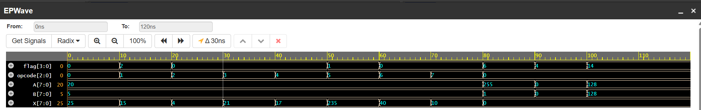

# 8-bit ALU Design

## What is an ALU?

An Arithmetic Logic Unit (ALU) is a core component of a processor that performs arithmetic and logical operations on data.

It takes input values, performs an operation based on a control signal (opcode), and produces a result along with status flags.

---

## How is the ALU used?

The ALU is used in digital systems and CPUs to:

* Perform arithmetic operations (addition, subtraction)
* Perform logical operations (AND, OR, XOR, NOT)
* Perform shift operations
* Generate flags for decision-making (used in branching and comparisons)

---

## Operations Supported

The ALU performs the following operations based on the opcode:

| Opcode | Operation                 |
| ------ | ------------------------- |
| 000    | ADD                       |
| 001    | SUB                       |
| 010    | AND                       |
| 011    | OR                        |
| 100    | XOR                       |
| 101    | NOT                       |
| 110    | Logical Shift Left (LSL)  |
| 111    | Logical Shift Right (LSR) |

---

## Code Explanation

### Inputs and Outputs

* A, B: 8-bit input operands
* opcode: 3-bit control signal
* X: 8-bit result
* flag: 4-bit status output

---

### Temporary Register

```verilog
reg [8:0] tmp9;
```

This is used to store intermediate results for arithmetic operations to capture carry or overflow beyond 8 bits.

---

### Addition

```verilog
tmp9 = {1'b0, A} + {1'b0, B};
X = tmp9[7:0];
```

* Inputs are extended to 9 bits
* Result is truncated to 8 bits
* Carry is stored in the extra bit

---

### Subtraction

```verilog
tmp9 = {1'b0, A} + {1'b0, (~B)} + 9'd1;
```

* Implements subtraction using 2’s complement
* Ensures correct hardware-level behavior

---

### Logical Operations

```verilog
X = A & B;
X = A | B;
X = A ^ B;
X = ~A;
```

* Perform bitwise operations on inputs

---

### Shift Operations

```verilog
X = A << 1;
X = A >> 1;
```

* Left shift doubles the value
* Right shift halves the value (logical)

---

## Flags

The ALU generates four status flags:

| Flag    | Meaning              |
| ------- | -------------------- |
| flag[0] | Sign (MSB of result) |
| flag[1] | Carry                |
| flag[2] | Zero                 |
| flag[3] | Overflow             |

### Flag Behavior

* Carry: Set when result exceeds 8 bits
* Zero: Set when result is zero
* Sign: Indicates negative result (MSB = 1)
* Overflow: Indicates signed arithmetic overflow

---

## Simulation

The ALU is tested using a Verilog testbench that:

* Applies different opcodes
* Tests arithmetic and logical operations
* Verifies edge cases like overflow and zero

---

## Waveform



---

## Project Structure

```text
alu/
 ├── rtl/alu.v
 ├── tb/alu_tb.v
 ├── sim/alu_waveform.png
 └── README.md
```

---
