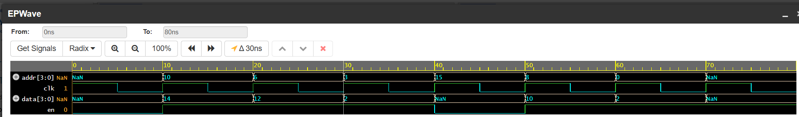

# 8-bit ROM Design

## What is ROM?

Read-Only Memory (ROM) is a type of memory used to store data permanently or semi-permanently.
Unlike RAM, data in ROM is typically written once (during initialization) and only read during operation.

---

## How is ROM used?

ROM is used in digital systems to:

* Store fixed data or constants
* Store program instructions
* Provide lookup tables

The CPU or system reads data from ROM using an address.

---

## Operation

ROM performs only one operation:

| Operation | Description                             |
| --------- | --------------------------------------- |
| Read      | Outputs stored data for a given address |

---

## Code Explanation

### Inputs and Outputs

* addr: Address input used to select memory location
* data_out: Output data stored at that address

---

### Memory Declaration

```verilog
reg [7:0] mem [0:255];
```

* 256 memory locations
* Each location stores 8 bits

---

### Initialization

```verilog
initial begin
    mem[0] = 8'd10;
    mem[1] = 8'd20;
    mem[2] = 8'd30;
end
```

* Memory is preloaded with values
* These values remain constant during simulation

---

### Read Operation

```verilog
always @(*) begin
    data_out = mem[addr];
end
```

* Output updates whenever address changes
* This is a combinational read

---

## Behavior

* When `addr` changes → corresponding data is output
* No clock is required
* No write operation is allowed

---

## Simulation

The ROM is tested using a testbench that:

* Changes address values
* Observes corresponding outputs
* Verifies correct data retrieval

---

## Waveform



---

## Project Structure

```text
rom/
 ├── rtl/rom.v
 ├── tb/rom_tb.v
 ├── sim/rom_waveform.png
 └── README.md
```

---
